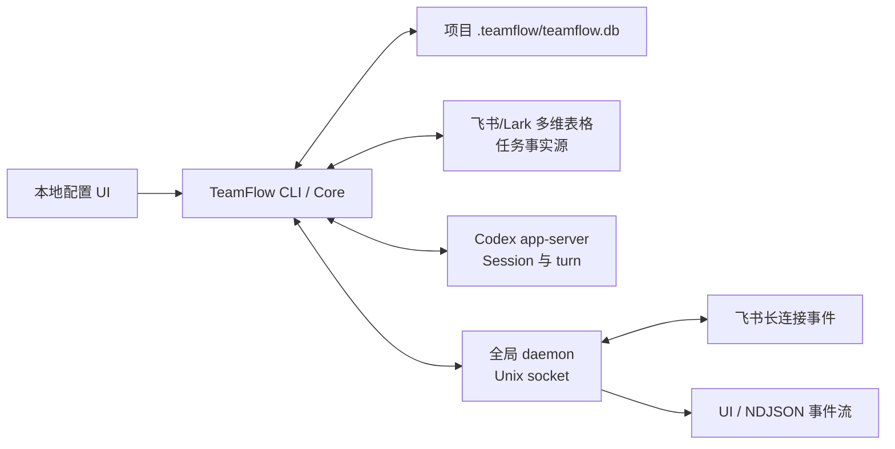

# TeamFlow 同舟

**让多个 AI Agent 像一个真正的项目团队一样协作。**

TeamFlow 是一个面向 Codex 的多智能体项目协作系统。它把独立的 Codex Session 组织成具有明确职责的 PM、技术负责人、QA 和设计团队，以飞书/Lark 多维表格承载共享任务状态，并通过显式工作流连接规划、执行、评审与验证。

## 为什么需要 TeamFlow

单个 Agent 可以完成任务，但多个 Agent 一起工作时，真正困难的是协作：谁负责决策、谁负责实现、任务进行到哪一步、交接时需要保留什么上下文、最终结果由谁验收。

如果这些信息只存在于聊天记录里，团队很快会遇到几个问题：

- Session 彼此隔离，角色和责任边界不清晰；
- 任务状态散落在对话中，缺少统一事实源；
- 交接依赖人工复制上下文，进展和证据容易丢失；
- Agent 的运行状态与项目任务脱节，难以判断谁正在工作；
- 多个项目和飞书应用各自建立连接，运行管理越来越复杂。

TeamFlow 把 Agent、角色、任务、工作流和事件连接到同一个项目协作层。人负责目标和决策，Agent 围绕共享看板协作，每一次任务推进都有明确的负责人、状态和结果证据。

## 核心能力

- 为每个项目创建独立的 `.teamflow/teamflow.db`。
- 配置飞书/Lark 用户身份或应用身份，并验证多维表格的认证、协作者、读写和清理权限。
- 创建多维表格，或连接已有的 Base/Wiki 多维表格链接。
- 初始化 `software-development` 任务表、字段、选项和看板视图。
- 用稳定字段键读取、创建和更新任务。
- 查找 Codex Session，把 Session 注册为 PM、技术负责人、QA 或设计 Agent，并检查其运行状态。
- 向空闲的 Codex Agent Session 发送一轮消息并等待结果。
- 运行一个全局 daemon，为相同飞书应用复用长连接，并按工作区路由记录/字段变更事件。
- 通过本地 Next.js UI 完成工作流、身份、看板、访问权限、事件监听和 Agent 配置。

## 架构与事实源



数据边界：

- 飞书/Lark 多维表格保存具体任务、业务状态、进展和结果证据，是任务事实源。
- 项目 `.teamflow/teamflow.db` 保存工作区、工作流投影、身份、看板、访问检查、监听状态和 Agent 注册信息。
- 全局 `~/.teamflow/teamflow.db` 登记已注册工作区；同目录还保存 daemon 的 socket、PID 和日志。
- Codex Session 内容由 Codex 管理，TeamFlow 保存 Session ID 并实时查询状态。

## 技术栈

- **Core**：Python 3.12、SQLite、标准库 Unix Domain Socket 与 multiprocessing
- **Agent runtime**：Codex app-server JSON-RPC、Codex Desktop IPC
- **Collaboration backend**：飞书/Lark OpenAPI、`lark-oapi` WebSocket、`lark-cli`
- **Configuration UI**：Next.js 16、React 19、Server Actions、SSE
- **Workflow model**：声明式 `workflow.json`、项目级 SQLite 投影、飞书多维表格任务协议

## 环境要求

- macOS 或支持 `fcntl`、Unix Domain Socket 的 POSIX 环境。
- [uv](https://docs.astral.sh/uv/)；仓库入口会用锁文件运行 Python。
- Python 3.12；`pyproject.toml` 限定为 `>=3.12,<3.13`。
- Node.js `>=20.9.0` 和 npm，仅本地 UI 需要。
- 可用的 Codex CLI 或 Codex/ChatGPT macOS 应用，仅 Session/Agent 功能需要。
- `lark-cli`，仅飞书用户授权和用户身份调用需要；可通过 `LARK_CLI` 指定其他路径。
- 一个已创建并发布的飞书/Lark 开放平台应用。

用户授权流程会申请以下 scope：

```text
bitable:app
docs:event:subscribe
docs:permission.member:auth
docs:permission.member:create
drive:drive.metadata:readonly
offline_access
```

若要使用事件监听，还需在开放平台把事件订阅方式设为长连接，添加以下事件，并发布应用版本：

```text
drive.file.bitable_record_changed_v1
drive.file.bitable_field_changed_v1
```

## 快速开始

克隆仓库：

```bash
git clone https://github.com/hchen13/TeamFlow.git
cd TeamFlow
```

所有 TeamFlow 命令都从仓库根目录运行。项目路径不会自动向父目录发现，建议始终传绝对路径。

```bash
PROJECT_ROOT=/absolute/path/to/project

./teamflow init \
  --workspace "$PROJECT_ROOT" \
  --display-name "My project" \
  --write-gitignore

./teamflow serve-ui --workspace "$PROJECT_ROOT"
```

首次运行会由 uv 安装锁定的 Python 依赖；首次启动 UI 会自动执行 `npm ci`。默认地址来自 `teamflow.config.json`：

```text
http://127.0.0.1:13145/
```

在 UI 中依次完成：

1. 选择 `software-development` 工作流。
2. 连接飞书用户身份，或填写应用 ID 和应用密钥保存 Bot 身份。
3. 粘贴已有多维表格链接，或用已保存身份创建新表。
4. 验证各身份的看板访问权限，并选择拥有者/管理员作为主身份。
5. 配置开放平台事件后，验证看板监听。
6. 在 Agent 页面选择项目的 Codex Session，并绑定角色。

UI 负责工作流、飞书身份、看板访问、事件监听和 Agent Session 的集中配置。

## 初始化任务看板

配置并验证多维表格后，需要显式初始化 TeamFlow 的任务结构：

```bash
./teamflow initialize-lark-board \
  --workspace "$PROJECT_ROOT" \
  --task-prefix TF
```

`--task-prefix` 为 1–5 个字母、数字或中文字符；省略时会从项目显示名或目录名推导。任务 ID 由飞书自动生成，例如 `TF-0001`。

初始化遵循增量策略：补充缺失字段、选项和视图，不删除已有业务字段。若已有默认数据表为空，TeamFlow 会复用它并删除其中的空白占位记录；非空默认表不会被改造成任务表。

内置的 `software-development` 工作流包含四类项目角色：

| 角色键 | 角色 | 数量 |
| --- | --- | --- |
| `pm` | PM | 单个 |
| `tl` | 技术负责人 | 多个 |
| `qa` | QA | 多个 |
| `design` | 设计 | 多个 |

任务类型为 `requirement`、`decision`、`design`、`development`、`bug`、`validation` 和 `chore`。

## CLI 配置示例

### 应用身份与已有看板

应用密钥必须通过环境变量传入；命令行只接收环境变量名。

```bash
export TEAMFLOW_LARK_APP_SECRET='replace-me'

./teamflow configure-lark-identity \
  --workspace "$PROJECT_ROOT" \
  --app-id cli_xxx \
  --app-secret-env TEAMFLOW_LARK_APP_SECRET \
  --domain feishu

./teamflow configure-lark-board \
  --workspace "$PROJECT_ROOT" \
  --url 'https://example.feishu.cn/base/BASE_TOKEN?table=TABLE_ID&view=VIEW_ID'

./teamflow verify-lark-board \
  --workspace "$PROJECT_ROOT" \
  --stream
```

`configure-lark-board` 同时接受 `/wiki/...` 链接，但解析 Wiki 节点需要一个可用身份。`verify-lark-board` 不是纯读操作：它会创建、读取并清理临时记录，以确认真实写权限。

### 用户身份

推荐通过 UI 发起设备授权。若已经用 `lark-cli` 完成授权，可把已授权的用户身份保存到项目：

```bash
./teamflow verify-lark-user-identity --workspace "$PROJECT_ROOT"
```

该命令验证 `lark-cli` 登录态并保存身份元数据，不会主动发起登录。用户 access/refresh token 由 `lark-cli` 管理，不写入项目数据库。

若用户身份用于 daemon 长连接，还需取得同一个开放平台应用的 App Secret；TeamFlow 会从同 App 的已保存 Bot 身份或 `lark-cli config show` 中读取。

## 任务读写

创建任务时使用与界面语言无关的稳定字段键：

```bash
./teamflow upsert-lark-task \
  --workspace "$PROJECT_ROOT" \
  --json '{"title":"补充登录回归测试","status":"ready","type":"validation","priority":"P1","role":"qa","description":"覆盖登录成功与失败路径","acceptance_criteria":"测试通过并附结果证据"}'
```

读取任务：

```bash
./teamflow list-lark-tasks --workspace "$PROJECT_ROOT" --limit 100

./teamflow get-lark-task \
  --workspace "$PROJECT_ROOT" \
  --record-id rec_xxx
```

更新任务时传飞书记录 ID：

```bash
./teamflow upsert-lark-task \
  --workspace "$PROJECT_ROOT" \
  --record-id rec_xxx \
  --json '{"progress":"回归完成","status":"review","result_evidence":"见测试日志"}'
```

可写字段键包括：

```text
title, status, type, priority, role, agent, agent_id,
description, context, acceptance_criteria, dependencies,
progress, next_action, result_evidence, blocked_reason, waiting_on
```

`task_id` 由飞书生成，不能写入。任务读写使用稳定字段键，并校验字段名和枚举值。

## Codex Agent

列出并注册项目已有的 Codex Session：

```bash
./teamflow list-codex-sessions --workspace "$PROJECT_ROOT"
```

注册并检查 Agent：

```bash
./teamflow register-agent \
  --workspace "$PROJECT_ROOT" \
  --workflow software-development \
  --role pm \
  --harness-type codex \
  --session-id THREAD_ID \
  --display-name "PM"

./teamflow verify-agent --workspace "$PROJECT_ROOT"
```

发送一轮消息：

```bash
./teamflow send-agent \
  --workspace "$PROJECT_ROOT" \
  --agent-id AGENT_ID \
  --message "检查任务并给出下一步"
```

Agent runtime 使用 `codex` harness。TeamFlow 会恢复指定 Session、启动新的 turn、等待执行完成，并返回 Agent 的最终回复。

## daemon 与事件监听

`serve-ui`、监听验证和事件流命令会按需启动全局 daemon。也可以显式管理：

```bash
./teamflow daemon start
./teamflow daemon sync --workspace "$PROJECT_ROOT"
./teamflow daemon status
```

验证真实事件投递：

```bash
./teamflow verify-lark-listener --workspace "$PROJECT_ROOT"
```

该验证最多创建并清理三组临时记录，用于确认长连接确实收到记录变更事件。运行它的主身份需要多维表格管理权限。

以 NDJSON 观察指定工作区事件：

```bash
./teamflow listen-lark-events --workspace "$PROJECT_ROOT"
```

daemon 是全局单进程：同一 `brand + app_id` 只启动一个飞书 WebSocket worker，不同工作区按 `file_token + table_id` 路由事件。`listen-lark-events` 通过 NDJSON 输出指定工作区的实时事件流。

身份或看板配置变化后，执行 `daemon sync` 即可刷新工作区路由；`verify-lark-listener` 和 `listen-lark-events` 也会自动完成同步。退出 UI 或事件流不会停止全局 daemon。

不再需要监听时可显式停止：

```bash
./teamflow daemon stop
```

## 命令概览

| 分组 | 命令 |
| --- | --- |
| 工作区 | `init`、`inspect`、`select-workflow`、`serve-ui`、`self-check` |
| 飞书身份 | `configure-lark-identity`、`verify-lark-user-identity`、`refresh-lark-identity`、`remove-lark-identity` |
| 多维表格 | `configure-lark-board`、`create-lark-board`、`verify-lark-board`、`grant-lark-board-access`、`initialize-lark-board` |
| 任务 | `list-lark-tasks`、`get-lark-task`、`upsert-lark-task` |
| Agent | `list-codex-sessions`、`register-agent`、`update-agent`、`unregister-agent`、`verify-agent`、`send-agent` |
| 事件 | `verify-lark-listener`、`listen-lark-events`、`daemon` |

查看完整参数：

```bash
./teamflow --help
./teamflow COMMAND --help
```

除 `self-check` 和不依赖项目的 daemon 操作外，各命令的 `--workspace` 默认值都是执行命令的目录。

## 本地数据与安全

- 项目状态位于 `<project>/.teamflow/teamflow.db`。目录权限设为 `0700`，数据库权限设为 `0600`。
- Bot 应用密钥会以明文保存在 SQLite 中。`inspect --json` 会脱敏输出，但数据库本身没有加密。
- `--write-gitignore` 是显式选项，不会默认修改项目 `.gitignore`。请确保 `.teamflow/` 不会提交到版本库。
- `inspect` 会同时执行待应用的数据库迁移并同步工作流定义。
- 全局 daemon 状态默认位于 `~/.teamflow/`，可用 `TEAMFLOW_HOME` 覆盖。
- UI 默认只监听 `127.0.0.1`。若改为其他地址，请自行承担凭据和本地操作接口暴露风险。

## 开发与验证

Python 单元测试：

```bash
uv run --locked python -m unittest discover -s tests -v
```

本地配置自检：

```bash
./teamflow self-check
```

前端测试和构建：

```bash
npm --prefix ui test
npm --prefix ui run build
```

## 目录结构

```text
core/                     Python 核心、数据库、飞书、Codex 与 daemon
core/migrations/          项目 SQLite 迁移
scripts/teamflow.py       CLI 实现
teamflow                  基于 uv 的仓库入口
skills/software-development/workflow.json
                          软件开发工作流机器定义
docs/workflows/           工作流产品规则与架构边界
ui/                       Next.js 本地配置 UI
tests/                    Python 单元测试
```

详细的角色职责、任务协议、状态流转与协作规则见 [软件开发工作流设计](docs/workflows/software-development.md)。
