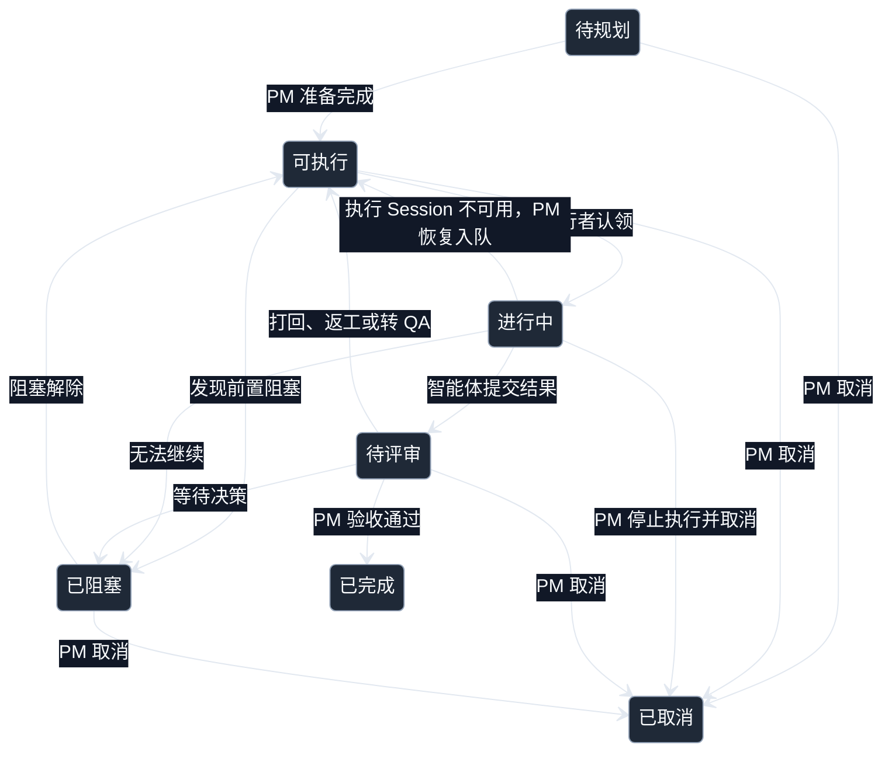

# 软件开发协作模式规格

> 状态：V1 设计基线
> 范围：TeamFlow `software-development` 协作模式
> 说明：本文只记录已经达成共识的产品规则和架构边界，不收录尚未验证的实现方案。

## 1. 文档目的

本文是 `software-development` 协作模式的设计事实源，用于约束后续看板初始化、后台调度程序、MCP 工具、技能文件、配置界面和测试实现，避免开发过程中出现以下问题：

- 状态、负责人、执行智能体和任务类型的含义逐渐混淆。
- PM、QA、技术负责人和设计使用不同的流转规则。
- 同一套协作规则分别散落在数据库、Python 子类、技能文件和 MCP 中。
- 同一次状态变化被重复处理。
- 尚未验证的技术方向被提前固化为实现约束。

内部代码继续使用 `workflow` 等稳定标识，面向用户的文档和界面统一使用中文术语。

## 2. 核心设计原则

1. 飞书多维表格中的任务记录是任务状态的事实源。
2. SQLite 保存项目配置、注册关系和定义投影，不复制完整任务数据。
3. 所有确定性规则由机器可读的协作模式定义表达，并由通用引擎执行。
4. 技能文件只描述各负责人如何做好工作，不负责定义合法状态和数据约束。
5. PM 是唯一协调负责人，也是所有待评审任务的最终决策者。
6. 只有 PM 可以修改任务负责人并进行跨负责人路由；其他智能体完成工作后只能提交待评审。
7. 项目决策人是外部决策者，不是第五种可注册负责人。
8. 不设置专用“测试中”状态，测试阶段由“状态 + 负责人”组合表达。
9. 飞书评论可用于人类讨论，但不能作为系统必须读取的结构化事实源。
10. 协作规则本身不依赖参与者是人类还是智能体；daemon、MCP 和智能体只是 TeamFlow 推动同一套规则运行的实现机制。
11. daemon 只负责发现、去重和通知，不代替实际执行者认领任务，也不因发送通知而修改任务状态或执行智能体。
12. 正式任务记录和看板结构遵循只增不减原则；取消和回滚必须保留任务及其历史痕迹，不能通过删除或清空来伪装成从未发生。

## 3. 核心概念

| 概念 | 定义 | 是否随任务流转变化 |
| --- | --- | --- |
| 协作模式 | 项目采用的协作方式，例如 `software-development` | 项目级选择 |
| 状态 | 任务当前处于哪个生命周期阶段 | 是 |
| 任务类型 | 这张卡本质上是什么类型的工作 | 通常不变 |
| 优先级 | PM 确定的执行优先级 | 可由 PM 调整 |
| 负责人 | 当前阶段由哪一种职能负责，也是正常任务分派队列 | 是 |
| 执行智能体 | 当前或最近执行该阶段的具体已注册智能体 | 是 |
| 等待对象 | 任务已阻塞时，解除阻塞需要谁提供决定 | 仅阻塞时使用 |
| 飞书身份 | 智能体操作飞书时使用的用户或应用身份 | 智能体配置，不是任务字段 |

### 3.1 任务类型与负责人

任务类型表达工作本质，负责人表达当前由哪一种职能处理。二者不能合并。

例如一张开发卡完成开发后需要测试：

```text
任务类型：开发
状态：可执行
负责人：QA
```

这张卡仍然是开发交付物，但当前已经进入 QA 负责队列。

### 3.2 负责人与执行智能体

- 负责人表示职能与队列，例如 QA。
- 执行智能体是注册到该负责人的具体会话。
- 任务处于“可执行”时不预先设置执行智能体，任何匹配该负责人的智能体都可以决定是否认领。
- 任何任务进入“可执行”时都必须清空此前的执行智能体。
- 认领动作必须由实际执行的智能体通过 TeamFlow MCP 发起；同一次操作将状态改为“进行中”并写入该执行智能体。
- daemon 可以通知智能体出现了可执行任务，但不能代替智能体认领。
- 进入“待评审”后保留提交结果的执行智能体，便于追溯。
- PM 在待评审、阻塞解除或故障恢复后将任务转交给新的负责人时，清空执行智能体，由新的实际执行者自行认领。

## 4. 负责人定义

| 稳定标识 | 中文 | 英文 | 是否允许多个智能体 | 职责摘要 |
| --- | --- | --- | --- | --- |
| `pm` | PM | PM | 否 | 范围、优先级、验收标准、任务路由、最终评审和项目决策人沟通 |
| `tl` | 技术负责人 | Technical Lead | 是 | 技术方案、任务拆解、实现、代码质量和技术风险 |
| `qa` | QA | QA | 是 | 行为验证、回归检查、测试证据和缺陷反馈 |
| `design` | 设计 | Design | 是 | 产品交互、视觉设计、用户体验和用户文案 |

`pm` 是该协作模式唯一的协调负责人。项目决策人不进入负责人表，也不能注册智能体。

## 5. 任务类型

V1 的任务类型固定，不允许 PM 在多维表格中自由增加选项。新增类型必须先进入协作模式定义，确保后台调度程序、MCP、看板和技能文件对其含义一致。

| 稳定标识 | 中文 | 英文 | 默认负责人 | 定义 |
| --- | --- | --- | --- | --- |
| `requirement` | 需求 | Requirement | PM | 澄清问题、范围、目标和验收标准 |
| `decision` | 决策 | Decision | PM | 比较选项、记录取舍并形成明确结论 |
| `design` | 设计 | Design | 设计 | 用户体验、界面、视觉、交互或用户文案产物 |
| `development` | 开发 | Development | 技术负责人 | 实现、重构和技术改造 |
| `bug` | 缺陷 | Bug | 技术负责人 | 缺陷复现、定位、修复和回归准备 |
| `validation` | 验证 | Validation | QA | 测试、验证、回归和发布检查 |
| `chore` | 工程事务 | Chore | 技术负责人 | 配置、构建、文档和工程维护 |

以下旧类型不再保留：

- “通用任务”：含义过宽，不能帮助路由或理解任务。
- “阻塞项”：阻塞是状态，不是工作类型。
- “QA”：QA 是负责人，相关工作类型统一使用“验证”。

任务类型的默认负责人只是创建任务时的建议，最终分派始终以“负责人”字段为准。

## 6. 优先级

优先级表达执行顺序，不等同于缺陷严重程度。V1 不单独增加“严重程度”字段。

| 优先级 | 定义 |
| --- | --- |
| `P0` | 生产不可用、数据或安全风险、发布完全阻断；需要立即中断其他工作处理 |
| `P1` | 核心路径受影响或近期交付存在明确风险；优先于普通计划 |
| `P2` | 正常计划内工作；默认值 |
| `P3` | 优化、清理、实验或可延期工作 |

优先级由 PM 设置。其他智能体可以提出调整建议，但不应自行改变。

## 7. 卡片字段契约

完整卡片结构由两部分组成：

```text
TeamFlow 公共任务协议
    +
software-development 的字段扩展与约束
```

协作模式定义使用稳定字段标识。飞书中展示的字段名称和字段 ID 是看板实例映射，不能替代稳定标识。

| 字段标识 | 中文字段名 | 英文字段名 | 建议字段类型 | 必填时机 | 语义与规则 |
| --- | --- | --- | --- | --- | --- |
| `title` | 任务 | Title | 主字段文本 | 创建时 | 简洁描述要完成的结果 |
| `task_id` | 任务 ID | Task ID | 自动编号 | 系统生成 | 面向人类引用，格式为“项目前缀 + 单调递增编号”；底层仍以 `record_id` 为主键 |
| `status` | 状态 | Status | 单选 | 创建时 | 生命周期阶段 |
| `type` | 任务类型 | Type | 单选 | 进入可执行前 | 当前协作模式定义的任务类型 |
| `priority` | 优先级 | Priority | 单选 | 进入可执行前 | `P0` 至 `P3`，默认 `P2` |
| `role` | 负责人 | Owner | 单选 | 进入可执行前 | 当前处理阶段由哪一种职能负责 |
| `agent` | 执行智能体 | Agent | 显示文本或单选 | 进入进行中时 | 面向用户显示的认领智能体名称 |
| `agent_id` | 执行智能体 ID | Agent ID | 隐藏文本 | 执行智能体已设置时 | TeamFlow 内部稳定智能体 ID |
| `description` | 任务描述 | Description | 多行文本 | 进入可执行前 | 做什么、为什么做、范围是什么 |
| `context` | 补充上下文 | Context | 多行文本 | 可选 | 约束、背景、链接和无法合理归类的重要信息；不能堆积进度日志 |
| `acceptance_criteria` | 验收标准 | Acceptance Criteria | 多行文本 | 进入可执行前 | 可验证的完成条件，包括任务特有的评审、测试或确认要求 |
| `dependencies` | 依赖任务 | Dependencies | 多行文本 | 可选 | V1 使用任务编号列表表达依赖 |
| `progress` | 当前进展 | Progress | 多行文本 | 执行中 | 当前状态摘要，更新现状而不是追加完整日志 |
| `next_action` | 下一步 | Next Action | 多行文本 | 执行中；进入已阻塞前 | 下一步可以直接执行的具体动作；阻塞时写明需要对方回答、批准或执行什么 |
| `result_evidence` | 结果与证据 | Result / Evidence | 多行文本 | 进入待评审或已取消前 | 实际评审结论、QA 结果、测试输出、取消依据、收尾安排、文件、链接和其他验收证据 |
| `blocked_reason` | 阻塞原因 | Blocked Reason | 多行文本 | 已阻塞时 | 为什么无法继续 |
| `waiting_on` | 等待对象 | Waiting On | 单选 | 已阻塞时 | PM 或项目决策人 |

任务特有的评审、测试或确认要求写入“验收标准”，相关背景和限制写入“补充上下文”，执行后的实际结论写入“结果与证据”。任务取消时，取消原因、对应的业务决定、受影响原因、产物处置结果或关联收尾任务也写入“结果与证据”。V1 不设置独立的“评审规则”或“取消原因”字段。

### 7.1 任务编号

- 人类可读格式为 `<项目前缀>-<序号>`，例如 TeamFlow 使用 `TF-0001`，Work Time Justin 可以使用 `WTJ-0001`。
- 前缀不编码日期、任务类型或协作模式；不同项目可以使用不同前缀，避免跨项目引用时产生歧义。
- `workflow.json` 定义 `task_id` 是自动编号字段及其序号长度，不写死具体项目前缀。
- 项目前缀在首次初始化看板结构时确认。命令行允许显式传入；未传入时，TeamFlow 优先使用工作区显示名称，否则使用目录名，并按空格、`-`、`_` 和驼峰边界分词。多个词取首字母，单个词取前三个字符，最多保留五个字符；拉丁字母转为大写，允许数字和中文，不做拼音转换，也不调用大语言模型。
- 智能体代用户初始化时，应给出建议前缀并请求用户确认，而不是直接接受默认值。
- 确认后的前缀直接写入飞书自动编号字段规则，序号由飞书维护。TeamFlow 不在 SQLite 中另存项目前缀或序号。
- 初始化完成后，飞书字段结构是编号规则的事实源；TeamFlow 不再维护独立的项目前缀配置。
- `record_id` 是程序访问任务的真实主键，任务编号只用于人类沟通和依赖引用。

### 7.2 评论和历史

- 评论适合人类讨论和临时补充。
- 影响流程的结论必须回填到结构化字段。
- “补充上下文”不能被评论替代，因为系统和智能体必须能通过稳定接口读取关键信息。
- 飞书字段修改历史用于记录操作者、时间和变更内容。
- 状态、负责人、执行智能体、当前进展、下一步和等待对象属于当前态字段，可以随合法流转更新；旧值由飞书修改历史保留。
- 正式任务记录不得因取消、返工或回滚被删除。已经记录的结果、证据、取消原因和收尾结论不得为了抹除痕迹而清空。

## 8. 状态机

### 8.1 状态定义

| 状态标识 | 中文 | 英文 | 定义 |
| --- | --- | --- | --- |
| `backlog` | 待规划 | Backlog | 尚未具备执行条件，可能缺少范围、优先级、验收标准或排期 |
| `ready` | 可执行 | Ready | 信息完整、没有阻塞、负责人已设置，现在可以被认领 |
| `in_progress` | 进行中 | In Progress | 已由具体执行者认领并正在执行；TeamFlow 中的执行者是已注册智能体 |
| `review` | 待评审 | Review | 已产生可验收结果，等待 PM 决策 |
| `blocked` | 已阻塞 | Blocked | 因业务问题、内部决策或项目决策人决策暂时无法继续 |
| `done` | 已完成 | Done | PM 已确认满足完成条件 |
| `canceled` | 已取消 | Canceled | PM 明确决定不再执行 |

“可执行”比传统“待办”更严格。未准备好的任务必须留在“待规划”，不能进入智能体队列。

### 8.2 状态流转



### 8.3 强制规则

- 不允许“可执行 -> 已完成”或“进行中 -> 已完成”，所有工作都必须经过待评审。
- “待规划 -> 可执行”是 PM 对任务已经准备完整的确认；进入可执行后不得退回待规划。
- 可执行任务后来发现无法继续时进入已阻塞；确认不再需要时进入已取消。
- “可执行 -> 进行中”只能由实际执行者认领触发；daemon 的通知不能改变任务状态或执行智能体。
- “进行中 -> 可执行”只用于当前执行 Session 经确认不可继续使用后的恢复，由 PM 执行并清空执行智能体。
- daemon 发现执行 Session 异常时只通知 PM，不能自动恢复入队或指定新的执行智能体。
- “进行中 -> 已取消”由 PM 发起；当前执行仍为 active 时，PM 必须先通过 TeamFlow MCP 停止当前 turn，确认停止后再完成取消。
- 所有待评审任务自动路由给 PM，不依赖负责人是否为 PM。
- 进入待评审时保留提交结果的负责人和执行智能体。
- 非 PM 智能体不得直接修改负责人或把任务转派给其他负责人；完成工作后只能提交待评审。
- PM 打回时，将状态改为可执行，并设置下一阶段负责人。
- PM 将任务转给 QA 时使用“可执行 + QA”，不创建“测试中”状态。
- QA 提交结果后再次进入待评审，由 PM 决定完成、返工或等待项目决策人。
- 已完成和已取消只能由 PM 设置，并且都是严格终态，不允许重新打开。
- 后续发现仍需继续工作时，必须新建任务并关联原任务。

### 8.4 取消决策权限

项目决策人负责确认需求、目标和范围是否发生变化，PM 负责将该业务决定映射到具体任务。项目决策人不需要理解任务拆分细节，也不逐张决定取消哪些卡片。

- 取消只涉及任务去重、拆分调整或被其他任务替代，并且不改变项目决策人已经确认的业务结果时，PM 可以直接决定取消。
- 取消源于需求、目标或范围变化时，PM 必须先向项目决策人说明要改变的业务事项及主要影响，并取得明确同意。
- 项目决策人确认业务变化后，由 PM 精确识别受影响的任务并逐张执行取消，不再要求项目决策人逐张确认。
- PM 必须在被取消的任务中记录取消原因、对应的业务决定以及该任务为什么受到影响。
- 尚未取得明确同意且取消会改变已经确认的业务结果时，任务继续保持已阻塞，PM 不能自行推断项目决策人的决定。

### 8.5 进行中的取消

项目决策人通常只表达需求、方向或范围发生变化，不需要知道 PM 已经拆出了哪些任务。PM 负责识别受影响的进行中任务，并决定哪些任务必须停止。

进行中的取消遵循以下流程：

1. 项目决策人或 PM 确认当前工作不应继续，例如需求撤销、方向变化或执行结果已经明显偏离目标。
2. PM 识别受影响的任务，并通过 TeamFlow MCP 停止对应执行 Session 的当前 turn。
3. TeamFlow 确认当前 turn 已停止；daemon 不得自行作出取消决定。
4. PM 判断如何处理已经产生的工作区改动；可以立即完成的收尾直接完成，需要独立执行的收尾先创建关联的“工程事务”任务。
5. 收尾已经完成或关联收尾任务已经安排后，PM 将原任务设为已取消。
6. 已取消任务保留最后的执行智能体、当前进展和已有证据，供后续追溯。

是否回滚以及如何回滚由 PM 根据实际工作区决定，不能由取消工具固定为一种策略：

- 独立 worktree 可能适合直接清理该任务的 worktree。
- 共享工作区可能需要保留、选择性回滚或整理已有改动。
- 自动回滚可能破坏其他任务或用户改动，因此不能作为默认行为。

当前只确定 TeamFlow 后续需要为 PM 提供足以执行所选收尾方案的 MCP 工具。具体工具边界、worktree 处理方式和回滚编排留到 MCP 与运行时设计阶段确定。

“已阻塞 -> 已取消”采用同一套收尾规则，不需要先恢复为可执行。若仍有与该任务对应的执行活动，PM 先停止执行；收尾已经完成或关联收尾任务已经安排后，直接将原任务设为已取消。

任务从已阻塞进入已取消前，PM 先将取消原因、对应的业务决定和收尾安排写入“结果与证据”，再清理等待对象、阻塞原因和下一步等不再成立的阻塞态字段。旧值继续保留在飞书修改历史中。

无论 PM 对代码、文件、数据库或其他外部产物采取何种回滚方案，飞书多维表格都不参与这种回滚：

- 不删除任务记录，不删除看板字段、选项或视图。
- 不把历史字段值恢复成“任务从未执行”的状态。
- 允许状态、当前进展和下一步等当前态字段按合法流程更新。
- 在任务卡中记录取消原因、对应的业务决定、实际采用的收尾方案，以及已经完成的处理结果或关联收尾任务。

## 9. 阻塞与人工决策

### 9.1 为什么需要等待对象

负责人和等待对象表达不同事实：

```text
负责人   = 阻塞解除后由哪一种职能继续执行
等待对象 = 当前需要谁提供决定
```

例如技术负责人遇到需求取舍：

```text
状态：已阻塞
负责人：技术负责人
执行智能体：当前技术负责人智能体
等待对象：PM
```

不能把负责人改成 PM，否则解除阻塞后还需要额外恢复原负责人；也不能把项目决策人作为负责人，因为项目决策人不是可注册和分派的智能体。

### 9.2 阻塞处理规则

1. 进入已阻塞状态前，必须同时填写等待对象、阻塞原因和下一步。
2. 智能体会话归档、连接失败或消息排队属于运行时健康与投递问题，不能把业务卡片改为已阻塞。
3. 非 PM 智能体将任务改为已阻塞时，将等待对象设置为 PM。
4. 任何任务新进入已阻塞状态，TeamFlow 向当前协作模式的协调负责人发送一次阻塞事件。
5. PM 可以决策时，记录结论，清理阻塞字段，并恢复为可执行。
6. PM 无法决策时，将等待对象改为项目决策人，并在同一轮会话中向用户提出明确问题。
7. 用户未回复时，任务保持已阻塞，TeamFlow 不重复向 PM 注入同一事件。
8. 用户在 PM 会话回复后，PM 记录决定并恢复任务流转。
9. 任务离开已阻塞状态后再次进入，视为新的阻塞事件。

PM 向项目决策人提问时，应给出：

- 需要决定的问题。
- 可选方案和主要影响。
- PM 的建议。
- 不作决定会阻塞哪些任务。

项目决策人长时间不回复时，受依赖关系影响的任务继续阻塞。这是正确的人工决策行为，不应通过智能体自行猜测绕过。没有依赖该决定的其他可执行任务可以继续执行。

### 9.3 执行 Session 不可用

运行时状态不能直接等同于执行 Session 不可用：

- 关闭 Codex CLI 或其他客户端窗口不会删除 Session；只要 app-server 仍能恢复 Session 并启动新一轮执行，该 Session 就仍然可用。
- `notLoaded` 和 `idle` 都是可继续使用的正常状态。
- `active` 表示 Session 正在工作，不能进行故障恢复或重新分派。
- `archived` 可以恢复，TeamFlow 只能通知 PM 或用户处理，不能擅自取消归档或恢复入队。
- `deleted` 表示 Session 已被永久删除，可以认定为不可用。
- `systemError`、读取失败或连接失败必须经过重新读取或恢复尝试；一次临时失败不能直接认定 Session 不可用。

执行 Session 经确认不可继续使用后：

1. daemon 向 PM 发送一次去重后的运行时故障通知，不修改任务卡片。
2. PM 判断是否恢复原 Session；无法恢复时，将任务从进行中恢复为可执行并清空执行智能体。
3. 任务保留原负责人、当前进展和下一步，由匹配该负责人的其他智能体自行认领。
4. 恢复入队不会自动回滚工作区文件；已有改动由 PM 或下一位执行者检查后处理。

## 10. 智能体与飞书身份

- 每个智能体可以绑定一个 `lark_identity_id`。
- 多个智能体可以共用同一个飞书身份。
- 智能体有显式绑定时，使用绑定身份操作飞书。
- 未绑定时，使用当前看板的主身份。
- 新建看板时，创建身份自动成为主身份；使用已有看板时，优先识别并绑定所有者，无法识别时由用户明确选择具有管理权限的身份并完成看板监听验证。
- 飞书身份不写入每张任务卡；真实操作者由飞书修改历史留痕。
- 智能体绑定的身份必须已经通过当前看板的访问验证，否则系统不应开始执行写操作。

## 11. 协作模式包

每一种内置协作模式由通用核心和一个自包含目录共同定义：

```text
skills/
  software-development/
    SKILL.md
    workflow.json
  general-task/              # 后续协作模式包
    SKILL.md
    workflow.json

core/
  workflow.py
```

协作模式相关信息分为以下层级：

| 层级 | 组成 | 职责 |
| --- | --- | --- |
| 定义源 | 通用核心 | 定义公共状态、优先级、基础字段和基础流转规则 |
| 定义源 | `workflow.json` | 定义当前协作模式特有的负责人、任务类型、字段扩展、必填条件和机器策略 |
| 定义源 | `SKILL.md` | 定义 PM、技术负责人、QA、设计如何工作和交付 |
| 项目投影 | SQLite | 保存插件定义在当前项目中的查询投影，以及当前选择、智能体注册和身份绑定等实例状态 |
| 任务事实源 | 飞书多维表格 | 保存具体任务、业务状态、进展和证据 |
| 规则消费者 | MCP、后台调度程序和配置界面 | 读取同一套定义和项目状态，不各自维护规则 |

SQLite 和飞书多维表格都不是协作模式定义源。一个协作模式的完整定义由“通用核心 + `workflow.json` + `SKILL.md`”组成。

`core/workflow.py` 负责加载、校验和执行任意协作模式，不包含 `software-development` 专用分支。

不建立 `BaseWorkflow -> SoftwareDevelopmentWorkflow` 的子类体系。当前差异可以通过声明式定义表达；只有未来出现无法声明表达的真实需求时，才考虑增加小型扩展点。

### 11.1 `workflow.json` V1 结构

V1 合约已经固定，完整内置定义见 [`skills/software-development/workflow.json`](../../skills/software-development/workflow.json)。根对象包含以下字段：

```json
{
  "schema_version": 1,
  "key": "software-development",
  "labels": {
    "zh-CN": "软件开发",
    "en": "Software development"
  },
  "short_descriptions": {
    "zh-CN": "由 PM、技术负责人、QA 和设计共同完成规划、实现、评审与验证。",
    "en": "Plan, build, review, and verify software work with PM, Technical Lead, QA, and Design."
  },
  "coordinator_role": "pm",
  "roles": [
    {
      "key": "pm",
      "labels": {
        "zh-CN": "PM",
        "en": "PM"
      },
      "descriptions": {
        "zh-CN": "负责范围、优先级、验收标准、任务路由、最终评审和项目决策人沟通。",
        "en": "Owns scope, priority, acceptance criteria, task routing, final review, and stakeholder alignment."
      },
      "allow_multiple": false
    }
  ],
  "task_types": [
    {
      "key": "development",
      "labels": {
        "zh-CN": "开发",
        "en": "Development"
      },
      "descriptions": {
        "zh-CN": "完成实现、重构或技术改造。",
        "en": "Implements, refactors, or performs technical changes."
      },
      "default_role": "tl"
    }
  ],
  "task_schema": {
    "base": "teamflow-task-v1",
    "required_for_ready": [
      "description",
      "acceptance_criteria",
      "priority",
      "role"
    ],
    "task_id": {
      "sequence_length": 4
    }
  },
  "policies": {
    "review_role": "pm",
    "stakeholder_escalation_role": "pm"
  }
}
```

通用加载器校验目录名与 `key` 一致、双语名称完整、稳定标识唯一、负责人引用有效，以及自动编号长度在飞书支持范围内。V1 不接受表达式语言、Python 钩子或动态脚本字段。


## 12. 数据库投影与启动同步

### 12.1 定义同步

每个 TeamFlow 进程启动时执行一次本地定义同步：

```text
打开项目数据库
→ 执行数据库结构迁移
→ 扫描 skills/*/workflow.json
→ 校验所有定义
→ 在一个事务内同步协作模式、负责人和任务类型
→ 加载工作区当前协作模式
→ 启动具体命令、配置界面、MCP 或后台调度程序
```

适用入口包括：

- `teamflow init`
- `server-ui`
- 后台调度程序
- MCP 服务
- 其他命令行命令

同步规则：

- 使用稳定的协作模式、负责人和任务类型标识幂等更新。
- 新工作区默认选择 `software-development`；其他已安装协作模式仍可由用户主动切换。
- 新数据库自动获得所有内置协作模式。
- 插件升级后，旧数据库自动获得新增协作模式、负责人和任务类型。
- 不覆盖工作区当前选择、智能体注册、飞书身份和看板配置。
- 删除负责人、修改稳定标识等破坏性变更必须通过数据库迁移。
- 不需要监听插件目录变化；升级后重启 TeamFlow 即可。
- 旧数据库迁移中已有的种子数据保留为历史兼容，后续不再用数据库迁移维护普通协作模式内容。

建议将该启动过程收敛为唯一的 `bootstrap_workspace()`，避免不同入口各自实现。

### 12.2 数据库保存什么

数据库中的协作模式相关表是插件定义在当前项目中的投影：

- `workflows`：可选择的协作模式及其中英文短描述。
- `roles`：协作模式下的负责人、中英文名称、是否允许多个智能体、协调负责人标记。
- `task_types`：协作模式下的任务类型、中英文名称及默认负责人。
- `workspaces.current_workflow_id`：当前项目选择。
- `agents`：项目实际注册的智能体、负责人、会话和飞书身份绑定。

长篇负责人职责不进入数据库，而是随技能文件发布。

## 13. 看板结构同步

定义同步只更新本地 SQLite，不能自动修改用户的飞书多维表格。

看板结构同步只在以下时机执行：

1. 第一次正式初始化协作看板。
2. 用户切换协作模式后，准备使用新的协作模式。
3. 插件升级导致当前协作模式的看板结构发生变化。
4. PM 或系统明确执行看板结构修复。

配置界面中的“验证并使用”只验证访问、读取、写入和清理能力，不初始化任务结构。

默认只允许安全的增量修改：

- 增加缺失字段。
- 增加缺失选项。
- 增加缺失视图。
- 不自动删除字段。
- 不自动删除选项或视图。
- 不自动修改已有字段类型。
- 发现不兼容结构时停止，并给出明确错误。

正式初始化后的看板结构和任务记录遵循只增不减原则。取消任务使用终态标记而不是删除记录；代码或外部产物的回滚不能删除任务、字段、选项、视图或已经留下的审计信息。配置阶段专门创建并立即清理的访问验证记录，以及初始化时尚未承载任何业务信息的空白占位记录，不属于正式任务记录。

完整字段结构由公共任务协议和当前协作模式定义合并生成，并按工作区选择的看板语言写入字段名和选项值。

## 14. 状态事件身份与幂等语义

飞书记录变更事件包含两个不同层级的标识：

- `header.event_id`：一次推送的唯一 ID，用于推送级幂等。
- `event.revision`：多维表格数据表的版本号，不是单条记录的版本号。

事件中的 `action_list` 包含 `record_id`、变更动作以及字段变更前后的值。

### 14.1 推送事件身份

```text
event_id
```

同一事件被飞书重复投递时只处理一次。

### 14.2 协作模式状态事件身份

```text
table_id + source_revision + record_id + transition_type
```

例如：

```text
tbl123:41:rec456:blocked_entered
```

状态变化示例：

```text
revision 41: 进行中 -> 已阻塞      => blocked_entered
revision 42: 修改阻塞原因          => blocked_updated
revision 50: 已阻塞 -> 可执行      => blocked_left
revision 63: 可执行 -> 已阻塞      => 新的 blocked_entered
```

第二次进入已阻塞状态时使用新的源版本号，因此会形成新的阻塞事件；重复投递版本 41 不会再次提醒 PM。

本节只规定同一次状态变化与后续再次发生的状态变化必须可区分，具体事件接入与执行机制不在本文中定义。

## 15. 协作模式引擎校验责任

智能体必须通过 MCP 和同一个协作模式引擎修改任务。后台调度程序读取同一套规则来识别需要通知的事件，但不能代替执行者修改业务状态或认领任务。协作模式引擎至少执行以下校验：

- 状态流转是否合法。
- 进入可执行所需字段是否完整。
- 负责人是否属于当前协作模式。
- 非 PM 智能体是否试图修改负责人或进行跨负责人转派。
- 进入可执行时是否已经清空执行智能体。
- 执行智能体是否已经注册到当前负责人。
- 进入进行中是否由实际执行智能体认领，并在同一次操作中写入该智能体。
- 进行中恢复为可执行是否由 PM 发起，且原执行 Session 已经确认不可继续使用。
- 进行中取消是否由 PM 发起，且当前执行 turn 已经通过 TeamFlow MCP 停止并得到确认。
- 进入已阻塞状态时是否填写等待对象、阻塞原因和下一步。
- 非 PM 是否试图直接将等待对象设置为项目决策人。
- 进入待评审或已取消前是否填写结果与证据。
- 已完成或已取消是否由 PM 设置。
- 取消或回滚是否试图删除正式任务记录、看板结构或已经留下的审计信息。
- 任务类型是否属于当前协作模式的固定集合。

错误必须包含操作被拒绝的具体原因和允许的修复方式，例如：

```text
无法将 TF-0042 移至可执行：验收标准为空。
无法将 agent_x 分配给 QA：该智能体注册在技术负责人名下。
无法将等待对象设为项目决策人：只有当前协作模式的协调负责人可以升级给项目决策人。
```

## 16. 中英文与语言偏好

### 16.1 稳定标识与双语名称

- 协作模式、负责人、任务类型、字段和枚举选项都使用与语言无关的稳定标识。
- 所有面向用户的名称、短描述、字段名和可选值都必须同时提供 `zh-CN` 与 `en` 两套名称。
- TeamFlow 默认使用中文；英文名称用于用户主动选择英文的场景。
- 程序逻辑、数据库关系和状态校验只使用稳定标识，不能依赖当前显示语言。
- 公共任务协议保存公共字段和枚举的双语名称；`workflow.json` 保存当前协作模式特有的双语名称。SQLite 中的相关内容只是这些定义在当前项目中的投影。
- 本文第 4、5、7、7.1 和 8 节给出了 V1 的中英文名称。

`waiting_on` 的选项定义为：

| 稳定标识 | 中文 | 英文 |
| --- | --- | --- |
| `pm` | PM | PM |
| `stakeholder` | 项目决策人 | Stakeholder |

优先级选项值 `P0`、`P1`、`P2`、`P3` 在中英文看板中保持不变，说明文本按界面语言展示。

### 16.2 两层语言偏好

TeamFlow 存在两种不同作用域的语言设置：

| 设置 | 作用域 | 行为 |
| --- | --- | --- |
| 配置界面语言 | 当前用户或浏览器 | 控制 TeamFlow 界面文案，可随时切换，不修改飞书多维表格 |
| 看板语言 | 当前工作区 | 控制初始化到飞书多维表格中的字段名、选项值和视图名称 |

飞书多维表格是共享文档，同一字段不能根据查看者分别显示中文或英文。因此，看板语言不能跟随每个查看者动态变化。

- 配置流程允许用户按偏好选择中文或英文，并将结果保存为工作区的看板语言。
- 新工作区默认使用中文看板，用户可以在初始化前改为英文。
- 首次初始化看板时，使用该工作区的看板语言。
- 切换 TeamFlow 配置界面语言不会重命名既有看板字段或选项。
- 修改既有看板语言必须是一次明确的看板结构同步操作，不能由前端语言开关隐式触发。

## 17. V1 非目标

- 不提供自由创建协作模式的配置界面。
- 不允许在飞书中随意扩展任务类型。
- 不把项目决策人注册成智能体。
- 不为每个协作模式创建 Python 子类。
- 不把评论作为后台调度程序的唯一输入。
- 不自动删除或破坏用户已有的看板字段。
- 不提前设计任意规则语言或插件钩子系统。

## 18. 官方参考

- [飞书多维表格记录变更事件](https://open.feishu.cn/document/docs/bitable-v1/events/bitable_record_changed?lang=zh-CN)
- [飞书列出数据表接口与版本号](https://open.feishu.cn/document/server-docs/docs/bitable-v1/app-table/list?lang=zh-CN)
- [飞书查询记录接口与系统字段](https://open.feishu.cn/document/docs/bitable-v1/app-table-record/search)
- [飞书多维表格数据结构](https://open.feishu.cn/document/server-docs/docs/bitable-v1/bitable-structure?lang=zh-CN)
- [飞书多维表格开放接口概述](https://open.feishu.cn/document/server-docs/docs/bitable-v1/bitable-overview)
